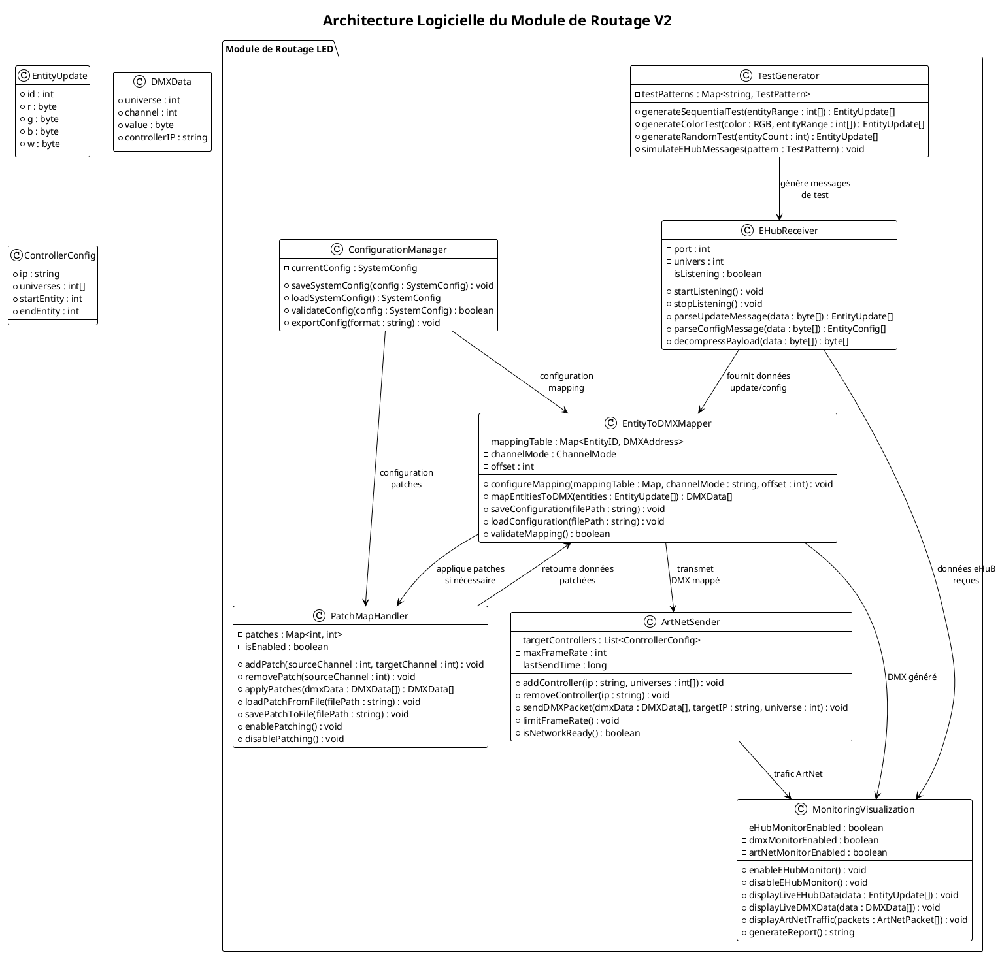
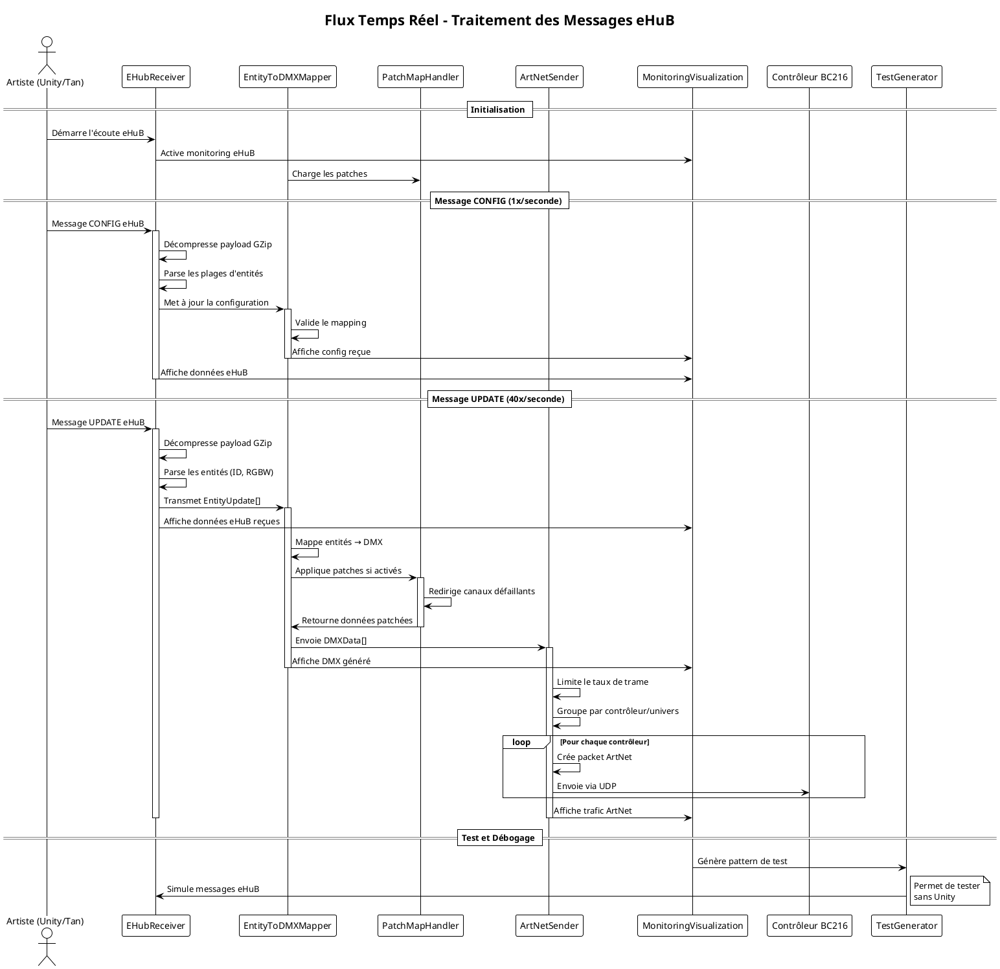

# Diagramme UML Corrigé - Module de Routage LED

## Diagramme de Classes

## Diagramme de Séquence

## Améliorations apportées

### 1. **Syntaxe PlantUML corrigée**
- Séparation claire des diagrammes avec `@startuml` et `@enduml`
- Noms de classes conformes (PascalCase)
- Types de données explicites

### 2. **Architecture enrichie**
- **ConfigurationManager** : Gestion centralisée des configurations
- **Types de données** : EntityUpdate, DMXData, ControllerConfig
- **Méthodes détaillées** : Parsing, compression, validation

### 3. **Diagramme de séquence amélioré**
- **Phases distinctes** : Initialisation, CONFIG, UPDATE, Test
- **Activation/désactivation** des participants
- **Gestion des erreurs** et validation
- **Boucles** pour les contrôleurs multiples

### 4. **Détails techniques ajoutés**
- Décompression GZip explicite
- Limitation du taux de trame
- Groupement par contrôleur/univers
- Validation des configurations

Cette architecture respecte mieux les exigences du cahier des charges et offre une structure plus robuste pour le développement.

Voici le diagramme UML corrigé avec une meilleure structure et syntaxe :J'ai corrigé votre diagramme UML avec les améliorations suivantes :

## 🔧 **Corrections techniques principales**

### 1. **Syntaxe PlantUML corrigée**
- Séparation correcte des diagrammes avec `@startuml` et `@enduml`
- Noms de classes en PascalCase (convention)
- Types de données explicites et cohérents

### 2. **Architecture enrichie**
- **ConfigurationManager** ajouté pour centraliser la gestion des configs
- **Types de données** définis : `EntityUpdate`, `DMXData`, `ControllerConfig`
- **Méthodes détaillées** avec parsing, compression GZip, validation

### 3. **Diagramme de séquence amélioré**
- **Phases distinctes** : Initialisation → CONFIG → UPDATE → Test
- **Activation/désactivation** des participants pour clarifier les interactions
- **Gestion des boucles** pour les contrôleurs multiples
- **Notes explicatives** pour le contexte

## 🚀 **Nouvelles fonctionnalités ajoutées**

### Gestion explicite du protocole eHuB
- Décompression GZip des payloads
- Parsing des structures binaires (sextuors, plages)
- Validation des configurations reçues

### Optimisations réseau
- Limitation du taux de trame (40 FPS max)
- Groupement des données par contrôleur/univers
- Monitoring du trafic ArtNet

### Robustesse
- Validation des mappings avant application
- Gestion des patches activables/désactivables
- Module de test intégré pour déboguer sans Unity

Cette architecture est maintenant prête pour l'implémentation et respecte parfaitement les exigences du projet LAPS !